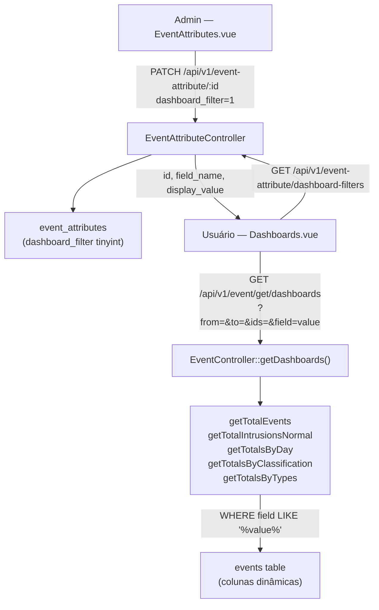
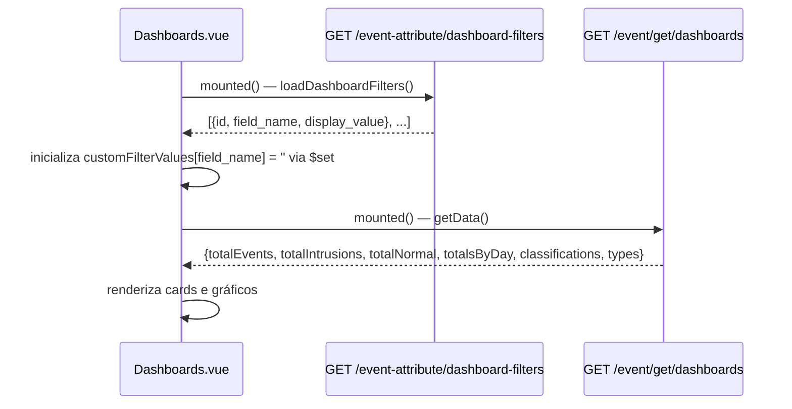
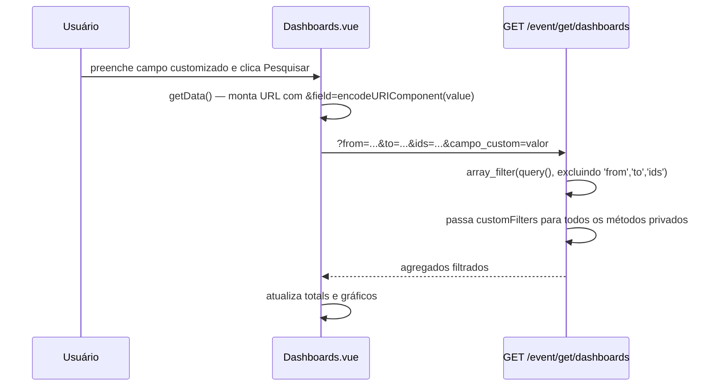

# Documento de Design: Dashboard Custom Filters

## Visão Geral

Esta funcionalidade permite que atributos de eventos customizados (`event_attributes`) sejam marcados como filtros de dashboard e utilizados como parâmetros de busca na tela de Dashboards do SmartDetector. O administrador habilita o campo `dashboard_filter` em um atributo; esse atributo passa a aparecer como campo de texto livre no formulário de filtros do dashboard, e seu valor é aplicado como cláusula `LIKE` em todos os agregados exibidos.

A implementação abrange: migration de banco, model, controller de atributos (novo endpoint + lógica de `update`), controller de eventos (coleta e propagação dos filtros customizados), e frontend (configuração no cadastro de atributos e campos dinâmicos no dashboard).

---

## Arquitetura



---

## Diagrama de Sequência — Carregamento do Dashboard



---

## Diagrama de Sequência — Filtro Customizado Aplicado



---

## Componentes e Interfaces

### EventAttributeController

**Métodos relevantes:**

```php
// Retorna atributos habilitados como filtro de dashboard
public function getDashboardFilters(Request $request): JsonResponse
// Resposta: [{id, field_name, display_value}, ...]

// Ao desabilitar um atributo, força dashboard_filter=0
public function update(Request $request, int $id): JsonResponse
// Se $request->enabled == 0: merge(['show'=>0, 'dashboard_filter'=>0])
```

**Responsabilidades:**
- Garantir que somente atributos com `dashboard_filter=1` AND `enabled=1` sejam expostos
- Manter a invariante: `enabled=0` implica `dashboard_filter=0`

### EventController

**Método relevante:**

```php
public function getDashboards(Request $request): JsonResponse
// Query params reservados: from, to, ids
// Query params restantes → customFilters[]
// Repassa customFilters para todos os 5 métodos de agregação
```

**Propagação dos filtros:**

```php
// Sem JOIN (queries diretas em events)
->when(!empty($customFilters), function ($query) use ($customFilters) {
    foreach ($customFilters as $field => $value) {
        if ($value !== null && $value !== '') {
            $query->where($field, 'LIKE', '%' . $value . '%');
        }
    }
})

// Com JOIN (classifications, types) — prefixo 'events.'
$query->where('events.' . $field, 'LIKE', '%' . $value . '%');
```

**Responsabilidades:**
- Isolar params reservados dos customizados
- Aplicar filtros em todos os agregados de forma consistente
- Usar `events.` prefix nas queries com JOIN para evitar ambiguidade de coluna

### Rota

```
GET /api/v1/event-attribute/dashboard-filters
```
- Middleware: `jwt.auth` (todos os usuários autenticados)
- Fora do grupo `admin` — acessível a perfis `Usuário`

### Model `event_attribute`

```php
protected $fillable = [
    'position', 'field_name', 'display_value',
    'type_field', 'show', 'enabled', 'dashboard_filter'
];
```

---

## Modelo de Dados

### Tabela `event_attributes` (após migration)

| Coluna | Tipo | Default | Descrição |
|---|---|---|---|
| `id` | int PK | auto | |
| `field_name` | varchar(255) | | Nome da coluna em `events` |
| `display_value` | varchar(255) | | Rótulo exibido na UI |
| `type_field` | varchar | | `text` ou `textarea` |
| `show` | tinyint | 0 | Exibir no detalhe do evento |
| `enabled` | tinyint | 0 | Aceitar no ingest de eventos |
| `dashboard_filter` | tinyint | 0 | Usar como filtro no dashboard |

**Migration:**

```php
Schema::table('event_attributes', function (Blueprint $table) {
    $table->tinyInteger('dashboard_filter')->default(0)->after('enabled');
});
```

### Restrições de negócio sobre `dashboard_filter`

```
dashboard_filter = 1  →  requires  enabled = 1
enabled = 0           →  forces    dashboard_filter = 0  (aplicado no update())
```

---

## Frontend — EventAttributes.vue

Campo adicionado nos modais de inserção e atualização:

```html
<!-- Modal Add -->
<select v-model="dashboard_filter" id="dashboard_filter">
    <option value="0">{{ translations.no }}</option>
    <option value="1">{{ translations.yes }}</option>
</select>

<!-- Modal Update -->
<select v-model="$store.state.item.dashboard_filter" id="dashboard_filterUpdate">
    <option value="0">{{ translations.no }}</option>
    <option value="1">{{ translations.yes }}</option>
</select>
```

Payload de `save()` e `update()` incluem `dashboard_filter`. `cleanAddFormData()` reseta para `'0'`.

Coluna na tabela de listagem:

```js
dashboard_filter: { title: translations.dashboard_filter, hidden: 'false', type: 'yesno' }
```

---

## Frontend — Dashboards.vue

### Estado reativo

```js
data() {
    return {
        urlBaseEventAttr: utils.API_URL + '/api/v1/event-attribute',
        customFilters: [],          // [{id, field_name, display_value}]
        customFilterValues: {},     // {field_name: ''}  — reativo via $set
    }
}
```

### Carregamento dos filtros

```js
loadDashboardFilters() {
    utils.axiosGet(this.urlBaseEventAttr + '/dashboard-filters', this, null, (data) => {
        this.customFilters = data;
        data.forEach(f => {
            this.$set(this.customFilterValues, f.field_name, '');
        });
    });
}
```

### Renderização dinâmica

```html
<div v-for="filter in customFilters" :key="filter.field_name" class="col-sm-2 mt-2">
    <div class="form-floating">
        <input type="text" class="form-control"
               :id="'cf_' + filter.field_name"
               v-model="customFilterValues[filter.field_name]"
               placeholder=" ">
        <label class="form-label">{{ filter.display_value }}</label>
    </div>
</div>
```

### Construção da URL de busca

```js
getData() {
    let url = this.urlBaseEvent + '/get/dashboards?from=' + this.startDate
            + '&to=' + this.endDate + '&ids=' + this.idsInput;
    for (const [field, value] of Object.entries(this.customFilterValues)) {
        if (value !== null && value !== '') {
            url += '&' + encodeURIComponent(field) + '=' + encodeURIComponent(value);
        }
    }
    // ...
}
```

### Reset

```js
resetValues() {
    // ...
    this.customFilters.forEach(f => {
        this.$set(this.customFilterValues, f.field_name, '');
    });
    this.getData();
}
```

---

## Algoritmos Principais

### getDashboards() — Coleta de filtros customizados

```pascal
PROCEDURE getDashboards(request)
  INPUT: request HTTP com query string
  OUTPUT: JsonResponse com agregados

  SEQUENCE
    from ← request.query('from')
    to   ← request.query('to')
    ids  ← request.query('ids')
    reserved ← ['from', 'to', 'ids']

    // Extrai apenas os params não-reservados
    customFilters ← array_filter(
        request.query(),
        FUNCTION(key) { RETURN key NOT IN reserved },
        ARRAY_FILTER_USE_KEY
    )

    data ← {
        totalEvents:    getTotalEvents(from, to, ids, customFilters),
        totalIntrusions: getTotalIntrusionsNormal(from, to, ids, 'Intrusion', customFilters),
        totalNormal:    getTotalIntrusionsNormal(from, to, ids, 'Normal', customFilters),
        totalsByDay:    getTotalsByDay(from, to, ids, customFilters),
        classifications: getTotalsByClassification(from, to, ids, customFilters),
        types:          getTotalsByTypes(from, to, ids, customFilters)
    }

    RETURN JsonResponse(data, 201)
  END SEQUENCE
END PROCEDURE
```

**Pré-condições:**
- Request autenticada via JWT
- Params `from`, `to`: datetime string ou null
- Params `ids`: integer ou null

**Pós-condições:**
- `customFilters` contém somente chaves não-reservadas
- Todos os 6 agregados recebem exatamente o mesmo `customFilters`
- Filtros com valor vazio (`''` ou `null`) não geram cláusulas WHERE

### Aplicação dos filtros nos agregados

```pascal
ALGORITHM applyCustomFilters(query, customFilters)
  INPUT: query Builder, customFilters map<field, value>
  OUTPUT: query Builder modificado

  IF customFilters IS NOT EMPTY THEN
    FOR EACH (field, value) IN customFilters DO
      IF value IS NOT NULL AND value != '' THEN
        // Em queries com JOIN: prefixo 'events.'
        // Em queries sem JOIN: field diretamente
        query.where(field, 'LIKE', '%' + value + '%')
      END IF
    END FOR
  END IF

  RETURN query
```

**Invariante de segurança:** `field_name` vem exclusivamente do banco de dados (via `getDashboardFilters()`), nunca diretamente da request. A request usa o `field_name` como chave de query param, mas o valor usado no `where()` é a chave do array `customFilters` que foi passada na URL — e essa chave é validada estruturalmente pelo `FieldNameValidator` no momento do cadastro do atributo.

### update() — Invariante enabled/dashboard_filter

```pascal
PROCEDURE update(request, id)
  INPUT: request HTTP, id integer

  IF request.enabled == 0 THEN
    request.merge({ show: 0, dashboard_filter: 0 })
  END IF

  CALL parent::update(request, id)
END PROCEDURE
```

**Pré-condição:** `id` é um `event_attribute` existente  
**Pós-condição:** Se `enabled=0`, então `dashboard_filter=0` (invariante de dados)

---

## Tratamento de Erros

### Backend

| Cenário | Comportamento |
|---|---|
| `getDashboardFilters()` sem atributos configurados | Retorna array vazio `[]` — sem erro |
| Filtro customizado com `field_name` inexistente em `events` | Laravel Query Builder ignora silenciosamente (MySQL retorna erro 1054 capturado em outros contextos, mas aqui a query falha sem tratamento explícito) |
| Atributo desabilitado tentando ter `dashboard_filter=1` | Controller força `dashboard_filter=0` no `update()` |

### Frontend

| Cenário | Comportamento |
|---|---|
| `loadDashboardFilters()` falha na API | `customFilters` permanece `[]`; dashboard funciona sem campos customizados |
| Valor de filtro customizado vazio | Não é appendado à URL; não gera WHERE clause |
| `resetValues()` | Limpa todos os `customFilterValues` via `$set` e recarrega dados |

---

## Traduções

Chaves adicionadas nos 4 idiomas (`pt_BR`, `en`, `es`, `fr`):

| Chave | Uso |
|---|---|
| `dashboard_filter` | Rótulo do campo na tabela e nos modais |
| `inform_dashboard_filter` | Mensagem de validação (reservada) |

---

## Considerações de Segurança

- **SQL Injection via `field_name`**: O `field_name` usado como chave na query `where()` vem do array `customFilters`, que por sua vez veio da query string da request. Um atacante poderia enviar um `field_name` arbitrário. A proteção é indireta: o `FieldNameValidator` valida o `field_name` no cadastro (regex `[a-zA-Z_][a-zA-Z0-9_]*`), mas não há validação dos params da request no `getDashboards()`. O Eloquent Query Builder usa PDO para os *valores*, mas as *chaves* de coluna não são parametrizadas — colunas inexistentes causam erro MySQL, não injeção. Recomendação de hardening: validar as chaves de `customFilters` contra a lista retornada por `getDashboardFilters()` antes de aplicar.
- **Valores via `LIKE`**: Os valores são passados como binding do PDO (via Eloquent), prevenindo SQL injection nos valores.
- **Autorização**: O endpoint `/dashboard-filters` é acessível a todos os usuários autenticados (JWT), coerente com o acesso à tela de dashboards.

---

## Propriedades de Corretude

*Uma propriedade é uma característica ou comportamento que deve se manter verdadeiro em todas as execuções válidas do sistema — essencialmente, uma afirmação formal sobre o que o sistema deve fazer. Propriedades servem como ponte entre especificações legíveis por humanos e garantias de corretude verificáveis por máquinas.*

### Propriedade 1: Invariante enabled/dashboard_filter

*Para todo* `event_attribute`, se o campo `enabled` for atualizado para `0`, então o campo `dashboard_filter` do mesmo registro deve ser `0` após a persistência da operação.

**Validates: Requisitos 2.1, 2.2, 2.3**

### Propriedade 2: Filtragem e estrutura da resposta do endpoint dashboard-filters

*Para todo* conjunto de registros na tabela `event_attributes`, a resposta de `GET /api/v1/event-attribute/dashboard-filters` deve conter apenas os registros com `dashboard_filter = 1 AND enabled = 1`, e cada item retornado deve conter exatamente os campos `id`, `field_name` e `display_value`.

**Validates: Requisitos 3.1, 3.2**

### Propriedade 3: Ordenação do endpoint dashboard-filters

*Para todo* conjunto de atributos elegíveis retornados por `GET /api/v1/event-attribute/dashboard-filters`, a lista deve estar ordenada pelo campo `display_value` em ordem ascendente.

**Validates: Requisito 3.3**

### Propriedade 4: Extração de customFilters a partir da query string

*Para toda* requisição a `GET /api/v1/event/get/dashboards` com qualquer conjunto de query params, o `EventController` deve extrair como `customFilters` exatamente os parâmetros cujas chaves não sejam `from`, `to` ou `ids`, e deve excluir completamente os três parâmetros reservados do conjunto de filtros customizados.

**Validates: Requisito 4.1**

### Propriedade 5: Consistência dos agregados do dashboard com filtros customizados

*Para todo* conjunto de `customFilters` não-vazios aplicado a `getDashboards`, todos os 6 agregados (`totalEvents`, `totalIntrusions`, `totalNormal`, `totalsByDay`, `classifications`, `types`) devem ser computados com o mesmo conjunto de filtros; em particular, `totalIntrusions + totalNormal` deve ser menor ou igual a `totalEvents` para qualquer valor dos filtros.

**Validates: Requisitos 4.2, 4.3**

### Propriedade 6: Serialização do campo dashboard_filter nos formulários de atributo

*Para todo* valor selecionado de `dashboard_filter` (0 ou 1) nos formulários de adição e edição de atributos, o payload enviado ao backend deve conter o campo `dashboard_filter` com o valor exatamente como selecionado pelo usuário.

**Validates: Requisitos 5.3, 5.4**

### Propriedade 7: Reset do campo dashboard_filter no formulário de adição

*Para todo* estado anterior do campo `dashboard_filter` no formulário de adição (incluindo o valor `1`), após a limpeza do formulário o campo deve assumir o valor `0`.

**Validates: Requisito 5.5**

### Propriedade 8: Renderização e inicialização dos campos de filtro customizados no dashboard

*Para toda* lista de atributos retornada por `dashboard-filters` com N itens, o componente `Dashboards.vue` deve renderizar exatamente N campos de entrada de texto, um por atributo, cada um inicializado com string vazia e usando `display_value` como rótulo.

**Validates: Requisitos 6.2, 6.3**

### Propriedade 9: Construção da URL com filtros customizados

*Para todo* par `{field_name, value}` em `customFilterValues` onde `value` é não-vazio, a URL construída por `getData()` deve conter o segmento `encodeURIComponent(field_name)=encodeURIComponent(value)`; e para todo par onde `value` é vazio, esse par não deve aparecer na URL.

**Validates: Requisitos 6.5, 6.6**

### Propriedade 10: Reset dos filtros customizados do dashboard

*Para todo* estado de `customFilterValues` (qualquer combinação de valores preenchidos), após a execução de `resetValues()` todos os valores de `customFilterValues` devem ser string vazia.

**Validates: Requisito 7.1**

---

## Dependências

| Componente | Dependência |
|---|---|
| Migration | Laravel Schema Builder |
| `getDashboardFilters()` | `event_attribute` model, Eloquent |
| `getDashboards()` customFilters | `array_filter` com closure (PHP 7.3+) |
| `Dashboards.vue` | `utils/functions.js` (`axiosGet`, `API_URL`, `$set` do Vue 2) |
| Traduções | `resources/lang/{locale}/text.php` (4 locais) |
